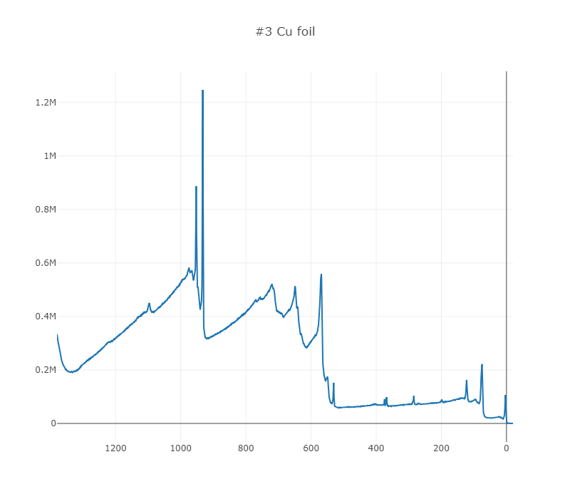

Usage of XPS tools for Jupyter Notebook
=======================================

.. code:: ipython3

    cd PHI_XPS_survey_narrow_tools/

.. parsed-literal::

    C:\xampp\htdocs\Materials_Data_Repository\src\PHI_XPS_survey_narrow_tools
    

.. code:: ipython3

    import subprocess
    subprocess.run(["MPExport.exe", "-Filename:..\source\XPS_PHI_QUANTERA_survey.spe", "-TSV"])

.. parsed-literal::

    CompletedProcess(args=['MPExport.exe', '-Filename:..\\source\\XPS_PHI_QUANTERA_survey.spe', '-TSV'], returncode=0)

.. code:: ipython3

    %run -i txt2csv.py XPS_PHI_QUANTERA_survey.txt

.. parsed-literal::

    SPECTRUM
    

.. code:: ipython3

    %run -i csv2graph_for_jupyter_plotly.py XPS_PHI_QUANTERA_survey.csv

.. code:: ipython3

    %run -i txt2raw_XPS_survey.py XPS_PHI_QUANTERA_survey.txt xps_raw_template.xml raw.xml

.. code:: ipython3

    %run -i raw2primary_XPS_survey.py raw.xml xps_primary_template.xml primary.xml

.. code:: ipython3

    %run -i batch_exe_XPS_jupyter.py ../source/XPS_PHI_QUANTERA_survey.spe
